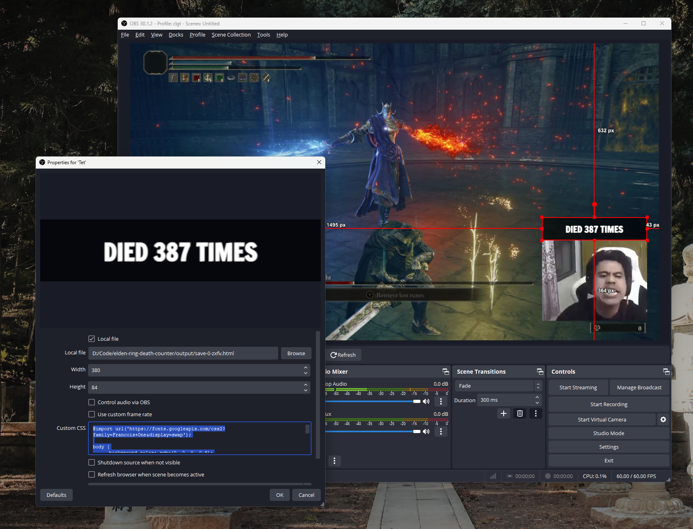

## Elden Ring Death Counter

> *Oh yes... Tarnished, are we? Come to the Lands Between for the Elden Ring, hmm?*
> *Of course you have. No shame in it.*
> *Unfortunately for you, however, you are maidenless.*

### Usage

```bash
$ elden-ring-death-counter.exe --help

Oh yes... Tarnished, are we? Come to the Lands Between for the Elden Ring, hmm?
Of course you have. No shame in it.
Unfortunately for you, however, you are maidenless.

Usage: elden-ring-death-counter.exe [OPTIONS] <INPUT>

Arguments:
  <INPUT>  Elden Ring save file location

Options:
  -o, --outdir <OUTDIR>    Location will write death count files (default: "output") [default: output]
  -f, --format <FORMAT>    Format of output files (defaut: "Death: {}"), where {} will be replaced by the death count [default: "Death: {}"]
  -F, --from <FROM>        Death counter will start from this value instead of counting total character death
      --outfile <OUTFILE>  Output file format (default: {slot}-{character_name}.txt) [default: {slot}-{character_name}.txt]
  -h, --help               Print help
  -V, --version            Print version

# Example
$ elden-ring-death-counter.exe C:\Users\Admin\AppData\Roaming\EldenRing\76561198250312914\ER0000.sl2
$ elden-ring-death-counter.exe .\76561198250312914\ER0000.sl2 -o .\Counter # output to `Counter` folder
$ elden-ring-death-counter.exe .\76561198250312914\ER0000.sl2 --from 183 -f "I death {} times since this morning" -o .\OBS # count from 183 with my customized format
```

### OBS Setup

1. [Download pre-built binary of Death Counter][download]
2. [Download pre-built binary of watchexec][watchexec]
3. Put all binaries in the your folder you want, example: `Desktop\DeathCounter`
4. Run command below, or try [this all-in-one bat script file][aio] (right click save)
```powershell
.\watchexec.exe -i <save_file> .\elden-ring-death-counter.exe <save_file> -o .\OBS
```
5. In OBS, create Text source with location `Desktop\DeathCounter\OBS\[slot]-[your_character_name].txt`

[aio]: https://raw.githubusercontent.com/monodyle/elden-ring-death-counter/8a8449432d30756561d9028fa578816bd0af4f6c/scripts/death-counter.bat
[download]: https://github.com/monodyle/elden-ring-death-counter/releases/latest
[watchexec]: https://github.com/watchexec/watchexec/releases/latest

> [!TIP]
> You can write output file as HTML & auto reload, then add a Browser source instead of Text source for better customization experience
> ```powershell
> .\watchexec.exe -i C:\Users\Admin\AppData\Roaming\EldenRing\76561198250312914\ER0000.sl2 .\elden-ring-death-counter.exe C:\Users\Admin\AppData\Roaming\EldenRing\76561198250312914\ER0000.sl2 --outfile "save-{slot}-{character_name}.html" --format "<h1>Today I died {} times</h1><script>setTimeout(() => window.location.reload(), 1000)</script>" --from 78
> ```

OBS Browser Source Example:

- Width: `380`
- Height: `84`
- Custom CSS:
```css
@import url('https://fonts.googleapis.com/css2?family=Tiny5&display=swap');

body { background-color: rgba(0, 0, 0, 0.8); color: #fff; margin: 0px auto; overflow: hidden; font-family: "Tiny5", sans-serif; display: grid; place-items: center }
```


